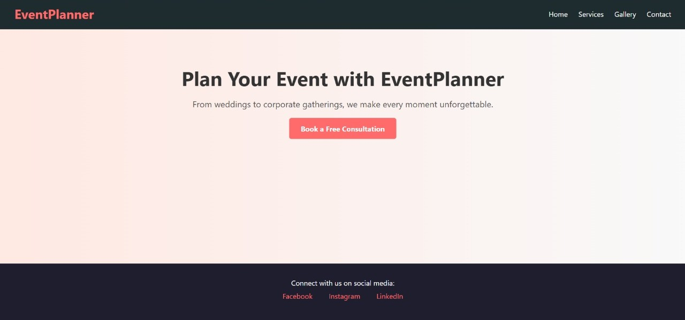
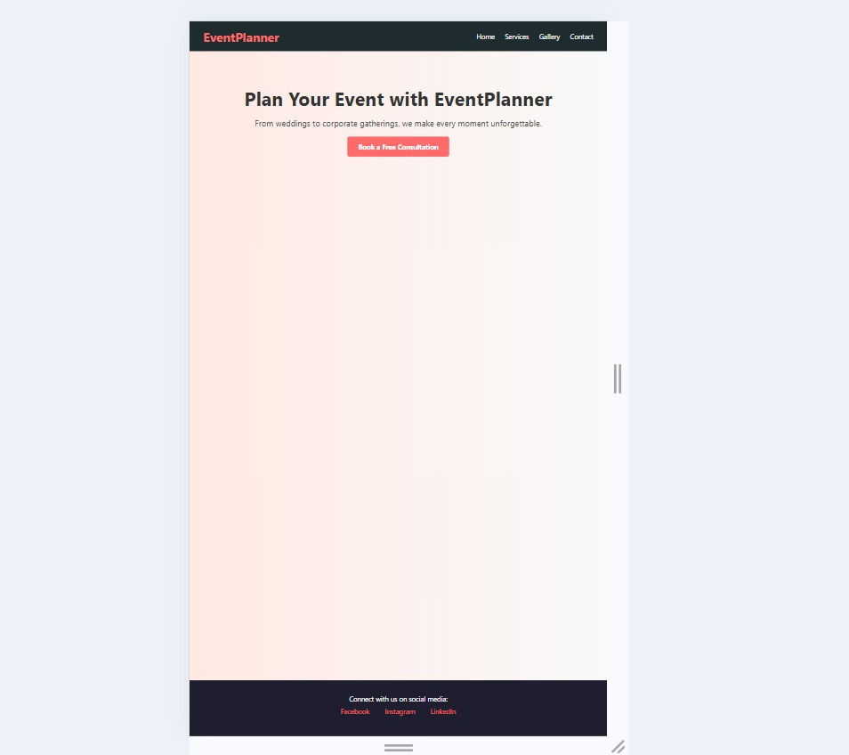

# task-4
Make a Website Mobile-Friendly Using CSS Media Queries

## Description:
Converted an existing desktop-only web page into a **mobile-friendly responsive layout** using CSS **media queries**.

## Technologies Used
- HTML5
- CSS3 (with Media Queries)
- Chrome DevTools (for responsiveness testing)
- VS Code

## What I Did
- Used media queries to target screens with a max-width of `768px`.
- Made the navigation menu stack vertically on smaller screens.
- Adjusted padding, margins, and font sizes for better readability on mobile.
- Ensured images and layout elements scale well and don't overflow.
- Fixed layout spacing to avoid horizontal scroll issues.

## Responsive Features
- Navigation menu collapses into vertical stack.
- Hero section scales text and button padding.
- Footer content remains centered and easy to read.
- Full compatibility with mobile screens (tested via Chrome DevTools).

## Files Included
- `index.html`: Main structure of the landing page
- `style.css`: Styling media queries
- `README.md`: Project description

## Screenshots

### Desktop View

### Mobile View

